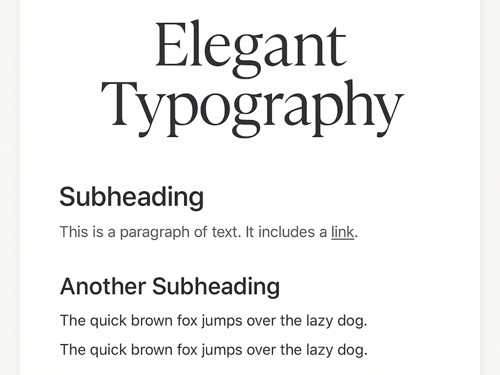

# Typography Theme



A modern, responsive WordPress theme with clean design focused on exceptional typography. Features large, readable text built with Tailwind CSS and vanilla JavaScript.

## Features

- **Typography-First Design**: Large, readable fonts with beautiful typography using Google Fonts (Crimson Text for headings, Inter for body text)
- **Fully Responsive**: Mobile-first design that looks great on all devices
- **Clean & Minimal**: Focus on content with minimal distractions
- **Tailwind CSS**: Modern utility-first CSS framework for easy customization
- **Vanilla JavaScript**: Lightweight navigation and smooth scrolling without dependencies
- **Accessibility Ready**: ARIA labels, keyboard navigation, and screen reader support
- **WordPress Standards**: Follows WordPress coding standards and best practices
- **Print Optimized**: Clean print styles for better readability when printed

## Installation

1. Upload the `typography-theme` folder to `/wp-content/themes/`
2. Navigate to the theme directory:
   ```bash
   cd wp-content/themes/typography-theme
   ```
3. Install dependencies:
   ```bash
   npm install
   ```
4. Build the CSS:
   ```bash
   npm run build
   npm run build-editor
   ```
5. Activate the theme through the WordPress admin panel

## Development

To work on the theme with hot-reloading:

```bash
npm run dev
```

This will watch for changes in your PHP files and rebuild the CSS automatically.

## Build for Production

```bash
npm run build
npm run build-editor
```

This will create minified CSS files in the `dist/css` directory.

## Theme Support

The theme includes support for:

- Custom Logo
- Custom Background
- Post Thumbnails
- Automatic Feed Links
- Title Tag
- HTML5 Markup
- Responsive Embeds
- Wide Alignment
- Editor Styles
- Two Navigation Menus (Primary & Footer)
- Widget Areas (Sidebar & Footer)

## Customization

### Typography

To change fonts, edit the `tailwind.config.js` file:

```javascript
fontFamily: {
  'serif': ['Your Serif Font', 'Georgia', 'serif'],
  'sans': ['Your Sans Font', 'system-ui', 'sans-serif'],
}
```

### Colors

The theme uses a minimal color palette based on Tailwind's gray scale. You can customize colors in your child theme or by modifying the Tailwind configuration.

### Spacing

The theme uses generous spacing for better readability. You can adjust the spacing in the template files or through custom CSS.

## File Structure

```
typography-theme/
├── dist/               # Compiled CSS files
├── js/                 # JavaScript files
├── src/                # Source CSS files
├── functions.php       # Theme functions
├── style.css          # Theme information
├── index.php          # Main template
├── header.php         # Header template
├── footer.php         # Footer template
├── single.php         # Single post template
├── page.php           # Page template
├── archive.php        # Archive template
├── search.php         # Search results
├── 404.php            # 404 error page
├── comments.php       # Comments template
├── searchform.php     # Search form
├── sidebar.php        # Sidebar template
├── package.json       # NPM configuration
└── tailwind.config.js # Tailwind configuration
```

## Browser Support

- Chrome (latest)
- Firefox (latest)
- Safari (latest)
- Edge (latest)

## License

GPL v2

## Credits

- Built with [Tailwind CSS](https://tailwindcss.com/)
- Typography enhanced with [@tailwindcss/typography](https://github.com/tailwindlabs/tailwindcss-typography)
- Fonts from [Google Fonts](https://fonts.google.com/)